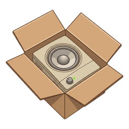

# Branding assets

Project icon art for chimebox: a cartoon **speaker unit in an open box**,
riffing on the Mac startup *chime* ("chime" + "box").



## Files

| File | Use |
|---|---|
| `chimebox-icon-master.png` | 2116×2116 transparent source (square, padded) |
| `chimebox-icon-512.png` … `chimebox-icon-16.png` | Rasterized icons at 512 / 256 / 128 / 64 / 48 / 32 / 16 px |
| `favicon.ico` | Multi-resolution favicon (16–256 px) |
| `chimebox-social-preview.png` | 1280×640 GitHub social-preview card (upload via repo **Settings → Social preview**) |

The icon files are RGBA with a transparent background; the social-preview card
is a full-bleed 1280×640 PNG.

## Provenance & licensing

> Informational, not legal advice — see [`../LICENSING.md`](../LICENSING.md).

- **AI-generated** with **Google Gemini** (consumer app), then post-processed
  locally with automated image operations — background knockout, square padding,
  rasterization — that add no creative authorship.
- **Inputs.** Made from text prompts and iterative edits of Gemini's own prior
  outputs — no third-party or copyrighted source images were supplied.
- **No rights asserted.** Under current U.S. Copyright Office guidance
  (*Copyright and Artificial Intelligence, Part 2*, Jan 2025), images generated
  purely from text prompts are **not copyrightable** in the U.S. — a prompt is
  not human authorship — and the purely mechanical edits above add none either.
  (Other jurisdictions may differ.) So the art is **uncopyrightable / no rights
  asserted** — not the same as a formal public-domain dedication. Chimebox
  claims no copyright in it, and it is **not** covered by the repository's
  Apache 2.0 license (which applies to original code, configuration, and docs).
- **No third-party marks.** The art contains no Apple logo or other known
  third-party trademarks.
- **No Google indemnity.** The consumer Gemini tier provides no IP
  indemnification — only Google's paid enterprise tiers (e.g., Vertex AI /
  Google Cloud) do. For a personal,
  non-commercial gift this risk is negligible; before any commercial use,
  review Google's current terms and consider a human-authored mark instead.
- **AI provenance metadata.** Google states its Gemini/Imagen images may carry
  an invisible SynthID provenance signal and/or "AI-generated" metadata; the
  local re-encoding that produced these files likely does not preserve it. This
  note is the authoritative provenance record regardless.

## Regenerating the set

The icon sizes and favicon are derived from the transparent master. Run from the
repository root (requires Pillow — `pip install Pillow`):

```sh
python3 - <<'PY'
from PIL import Image
m = Image.open('branding/chimebox-icon-master.png').convert('RGBA')
for s in (512, 256, 128, 64, 48, 32, 16):
    m.resize((s, s), Image.Resampling.LANCZOS).save(f'branding/chimebox-icon-{s}.png')
m.save('branding/favicon.ico',
       sizes=[(16, 16), (32, 32), (48, 48), (64, 64), (128, 128), (256, 256)])
PY
```
